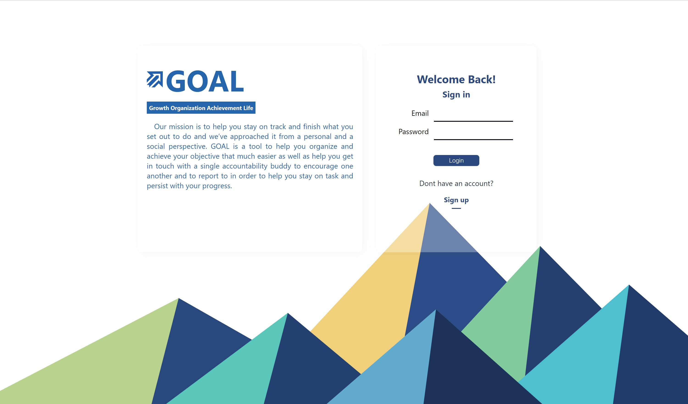
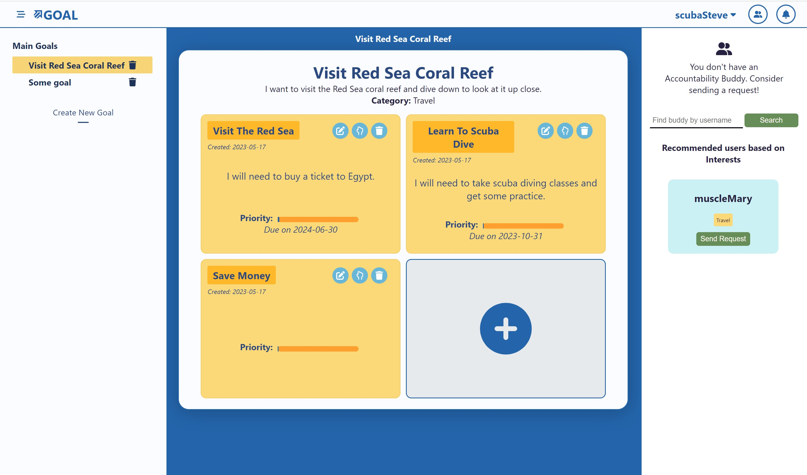
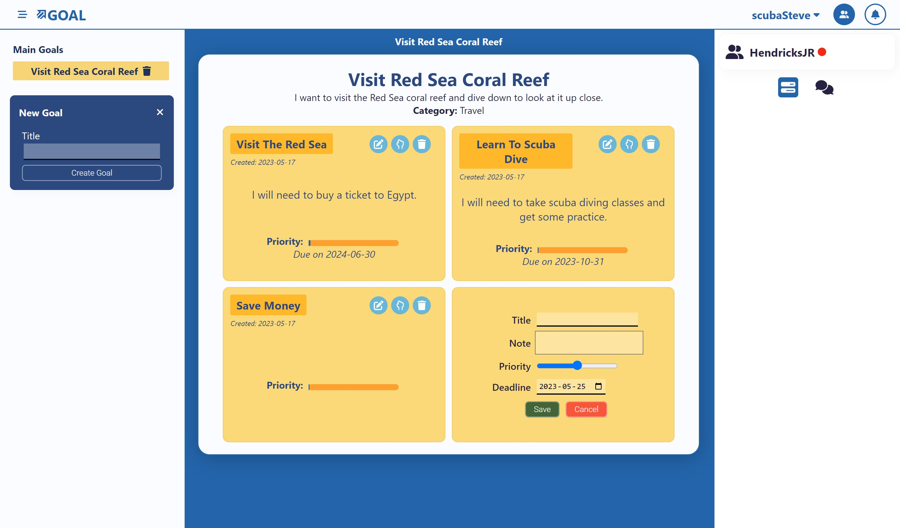

# GOAL 

## Description

GOAL is a productivity and organization app designed to help people set goals and see them through using a two-pronged approach. The first is a goal manager, which allows you to set long-term goals and break them down into smaller, more digestible milestones to establish a plan of action. The social aspect of our app lets you get in touch with an accountability buddy, helping each other along and holding each other accountable to stay on track.

## Click the image below for a video walkthrough
<a href="http://www.youtube.com/watch?feature=player_embedded&v=Je-H89G8CmQ
" target="_blank"></a>

## Screenshots

<p align="center">
  
  <br>
  Login Page
</p>


<p align="center">
  
  <br>
  Main View
</p>


<p align="center">
  
  <br>
  Add and edit goals; Chat Box
</p>

## Setup

To set up the GOAL app on your local machine, please follow the steps below:

**Note**: Make sure you have PostgreSQL installed before proceeding with the setup.

1. **Install Dependencies**
   - Open the root folder in your local terminal.
   - Run the following command in the `client` and `server` folders to install dependencies:
     ```
     npm install
     ```

2. **Start the Database**
   - In the `server` folder, run the following command to start the PostgreSQL database:
     ```
     sudo service postgresql start
     ```

3. **Seed the Database**
   - In the `server/prisma` folder, run the `seed.ts` file to seed the database.

4. **Start the Front-end and Back-end Servers**
   - In the `server` folder, run the following command to start the back-end server:
     ```
     npm run dev
     ```
     You should see the following response in your terminal:
     ```
     Server is listening on port 6080
     ```
   - In a separate terminal, navigate to the `client` folder and run the following command to start the front-end server:
     ```
     npm start
     ```

5. **Enjoy the App!**
   - Once the servers are up and running, you can access the GOAL app in your web browser at `http://localhost:3006/`.

## Dependencies

The GOAL app relies on the following dependencies:

- Fontawesome 6.4.0
- Redux 1.9.5
- Axios 1.4.0
- Babel 3.1.0
- Socket.io 4.6.1
- Prisma 4.14.0
- Bcrypt 5.1.0
- Cookie-Parser 1.4.6
- jsonwebtoken 9.0.0
- Nodemon 2.0.22
- ts-node 10.9.1
- typescript 5.0.4

Please ensure these dependencies are installed before running the app.
